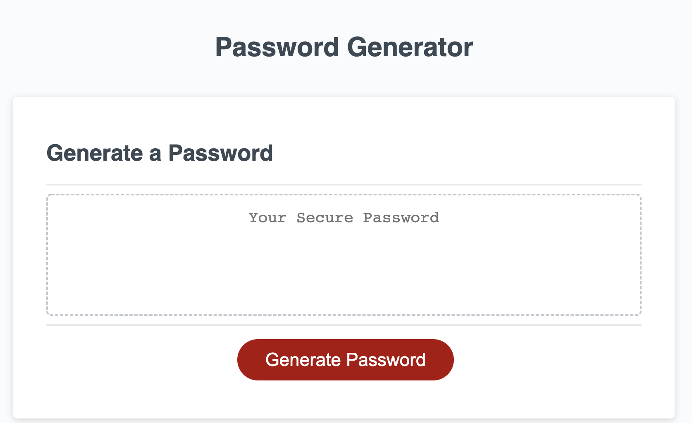
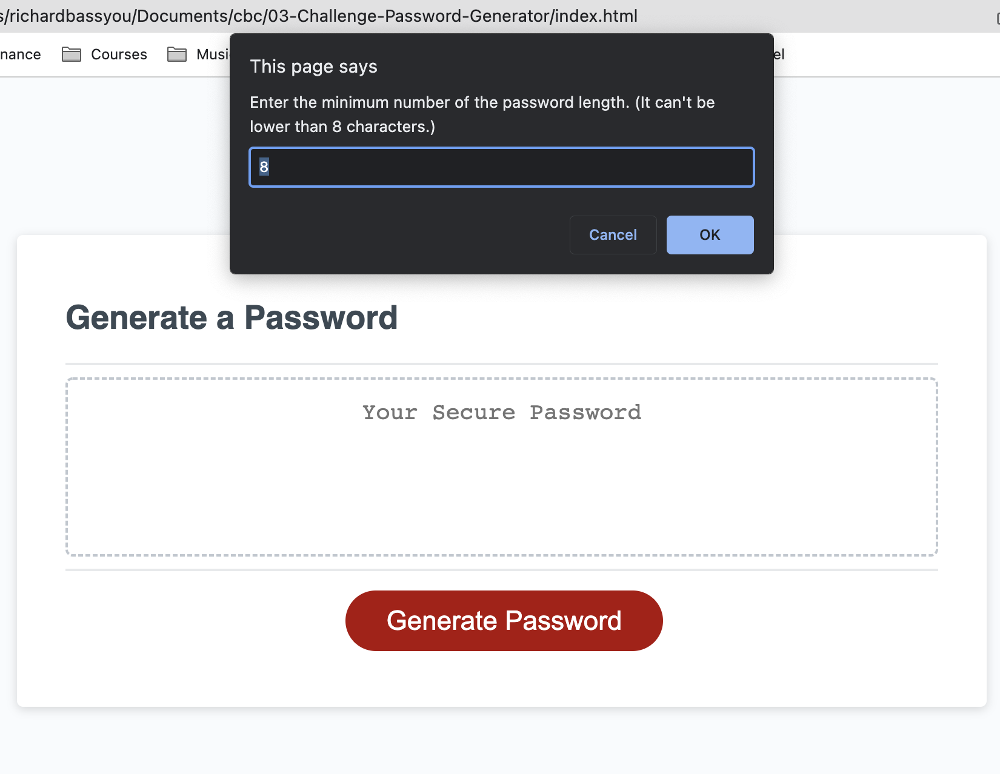
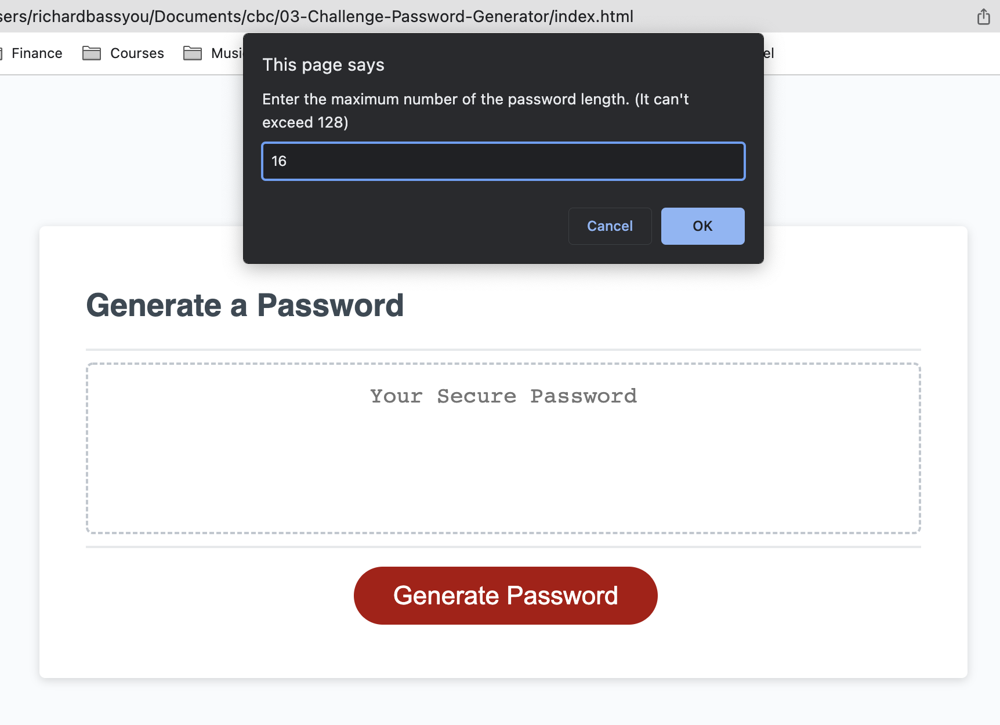
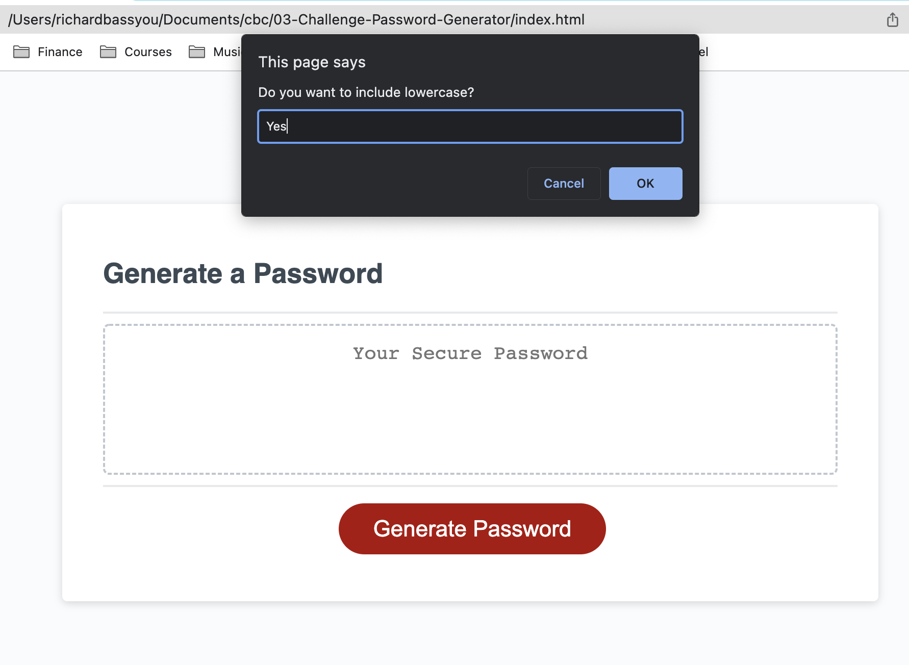
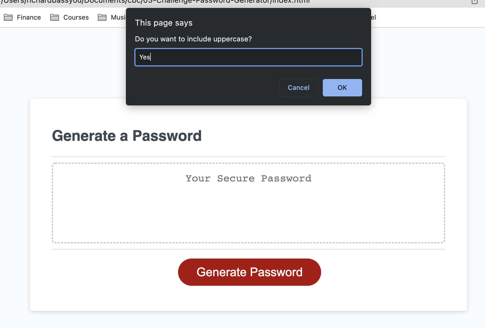
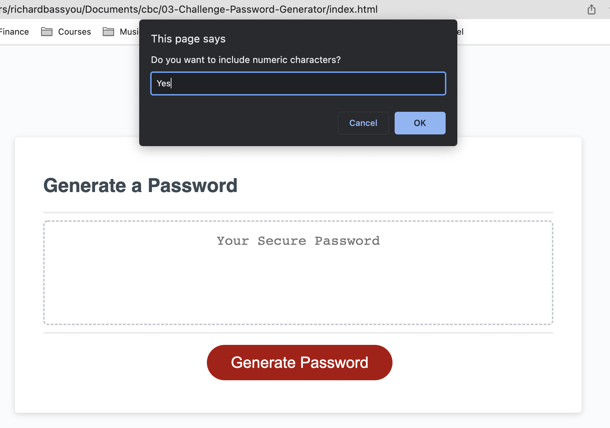
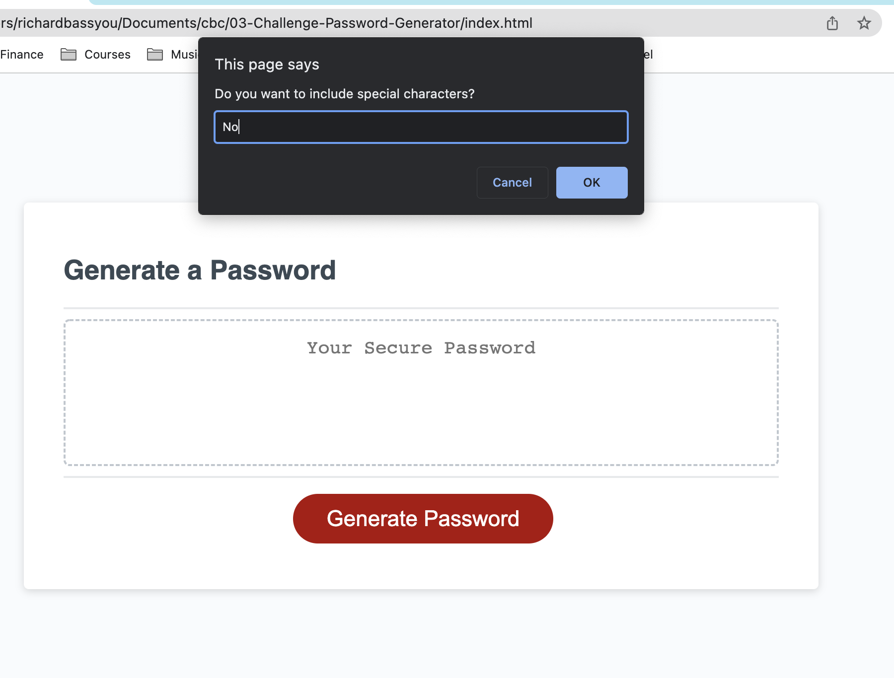
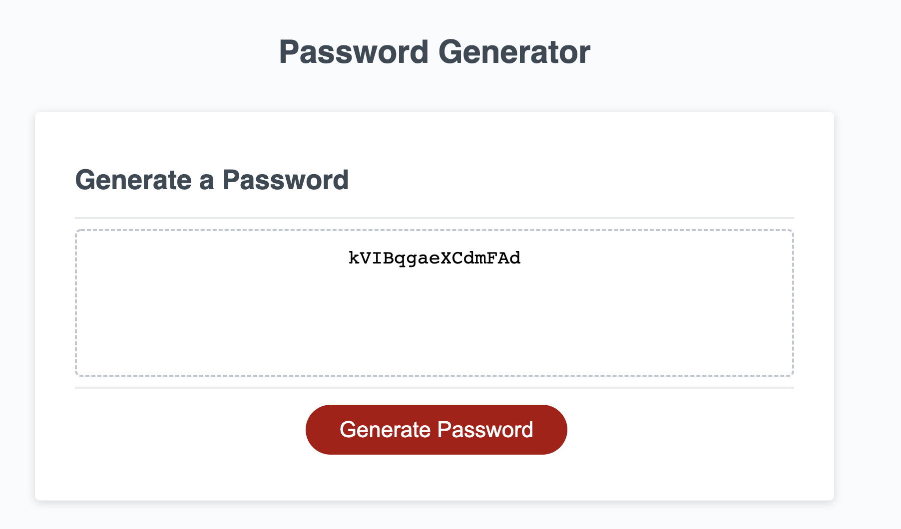

# 03 JavaScript: Password Generator

## URL of the Deployed Application 
[03 JavaScript: Password Generator](https://yichanyourichard.github.io/03-Challenge-Password-Generator/)

## My Task

The challenge #3 is to modify the starter code to create an application that enables to generate the password in given conditions.

## USER Story

```
AS AN employee with access to sensitive data
I WANT to randomly generate a password that meets certin criteria
SO THAT I can create a strong password that provides greater security
```

## Acceptance Criteria

```
GIVEN I need a new, secure password
WHEN I click the button to generate a password
THEN I am presented with a series of prompts for password criteria
WHEN prompted for password criteria
THEN I select which criteria to include in the password
WHEN prompted for the length of the password
THEN I choose a length of at least 8 characters and no more than 128 characters
WHEN asked for character types to include in the password
THEN I confirm whether or not to include lowercase, uppercase, numeric, and/or special characters
WHEN I answer each prompt
THEN my input should be validated and at least one character type should be selected
WHEN all prompts are answered
THEN a password is generated that matches the selected criteria
WHEN the password is generated
THEN the password is either displayed in an alert or written to the page
```

## SCREENSHOTS

The following image shows the web application's appearance and functionality:










## What I did in the coding

I created the variables of character sets of lowercase, uppercase, numerics, and special characters.
Then I created variable of final array that will be eventual array that we will going to use for generating password.

In the function generatePassword, I first created final array becomes empty to reset when we already had the values in array.
Then, I created multiple prompts for asking least number of characters, maximum number of characters, whether to include lowercase, uppercase, numeric and special characters. 
Then, I created alert message to show error when use entered invalid numbers or characters.
Also, I created alert message when user entered the higher minimum number than maximum's
Then, I created return to terminate the function if the prompt get error.
Lastly for prompt, I created if statement to show error if none of the characters have been selected. 

I created password Length variable to randomize the length of character that are between minimum number and maximum number.
I use for loop statement to generate password depends on the length of the characters that were also randomized as well.

function writePassword has been written to write password in the textbox along with generate function

Lastly, the generate button event has been created with addEventListener by "click" to process the code above. 

